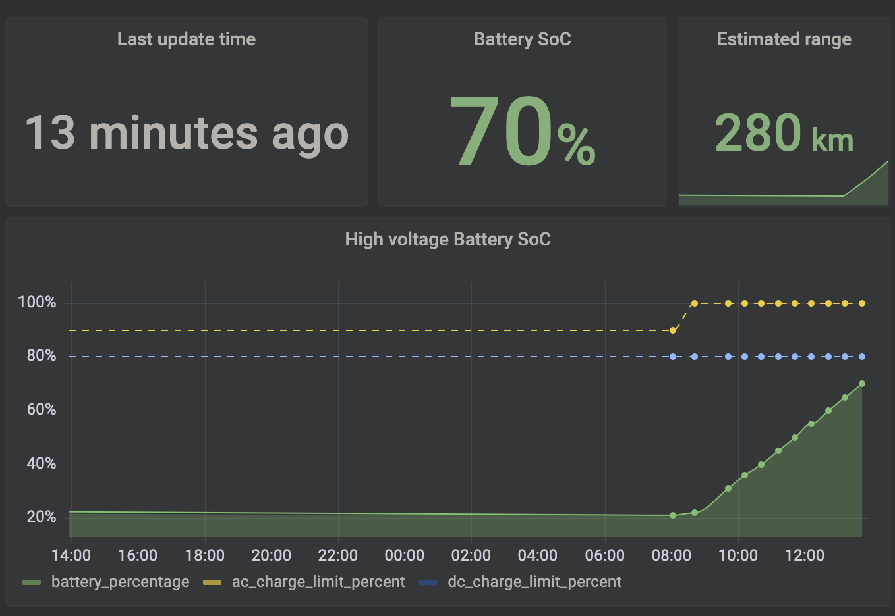
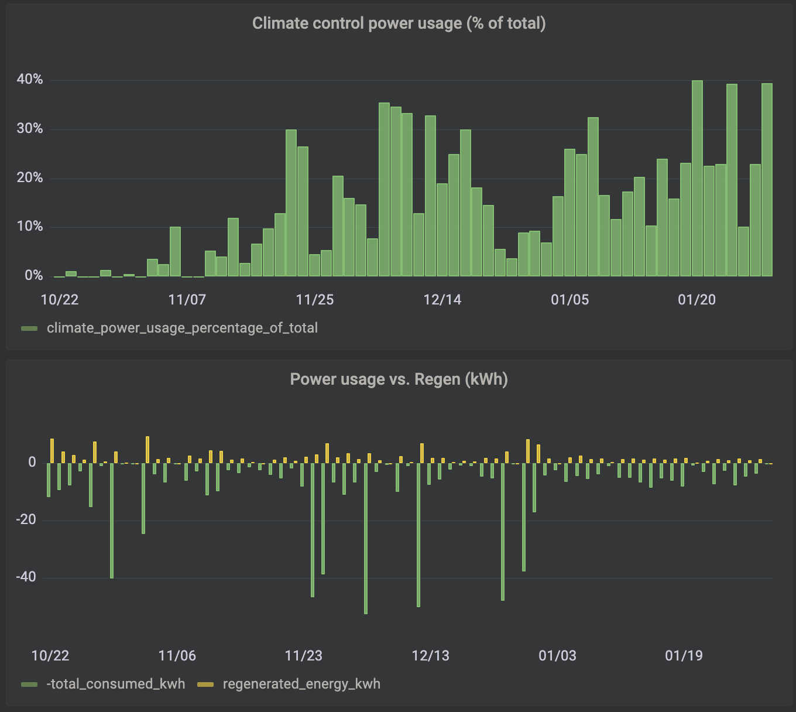
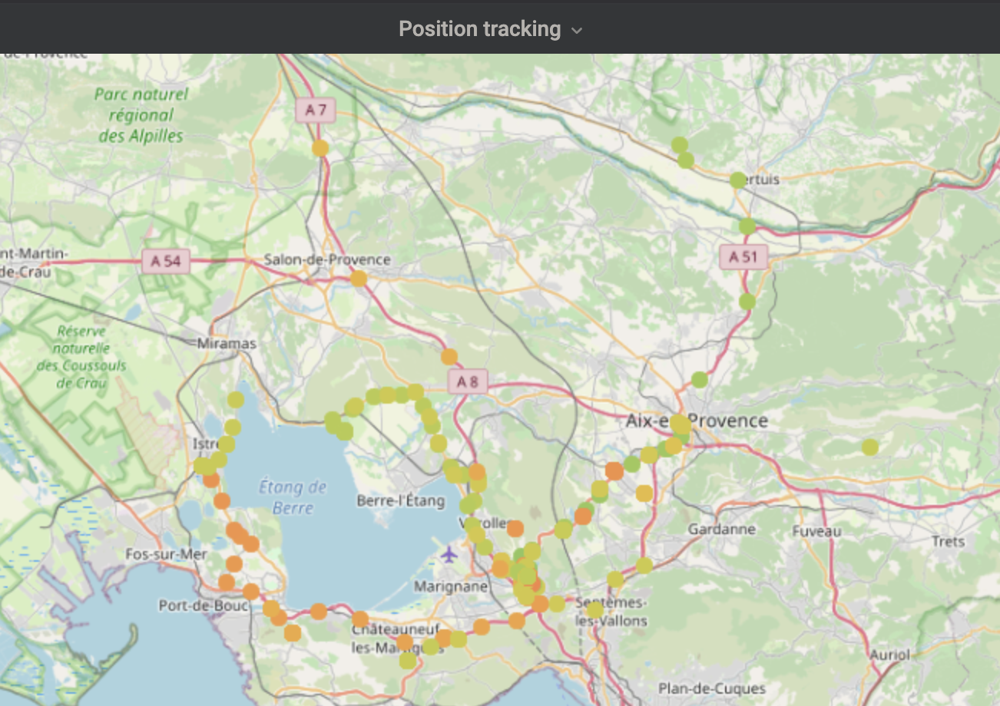

# kia-hyundai-tracker

Track your Kia/Hyundai car using the Kia Connect / Bluelink API.

# Installation

## Database

1. Make a copy of `default_database.db`, name it `database.db`

## Environment

1. Create a virtualenv
2. Install requirements: `pip install -r requirements.txt`

## Optional: Grafana

1. Install Grafana server
2. Connect to the admin panel (usually on port 3000)
3. Install the SQLite datasource plugin
4. Configure datasource: locate the DB file
3. Import the dashboards located in the "grafana dashboards" directory

# Configuration

1. Make a copy of `.env.default`, name it `.env`

2. edit `.env` with the required values (kia username, password, vehicle UUID) and change the default database path if
   needed

# Run daemon

`python main.py`

# Run HTTP server

`python http_server.py`

# Grafana screenshots

Power & regen stats

Location tracking